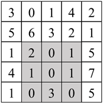

# 第二章：数组

## 面试题6：排序数组中两个数字之和
### 题目
输入一个递增排序的数组和一个值k，请问如何在数组中找出两个和为k的数字并返回它们的下标？假设数组中存在且只存在一对符合条件的数字，同时一个数字不能使用两次。例如输入数组[1, 2, 4, 6, 10]，k的值为8，数组中的数字2和6的和为8，它们的下标分别为1和3。

### 参考代码
``` python
class Solution:
    def twoSum(self, numbers: List[int], target: int) -> List[int]:
        n = len(numbers)
        if n < 2: return [-1, -1]
        i, j = 0, n - 1
        while i < j:
            if numbers[i] + numbers[j] == target:
                return [i, j]
            elif numbers[i] + numbers[j] > target:
                j -= 1
            else:
                i += 1
        return [-1, -1]
```

## 面试题7：数组中和为0的三个数字
### 题目
输入一个数组，如何找出数组中所有和为0的三个数字的三元组？注意返回值中不得包含重复的三元组。例如在数组中[-1, 0, 1, 2, -1, -4]中有两个三元组的和为0，它们分别是[-1, 0, 1]和[-1, -1, 2]。

### 参考代码
#### 解法一
``` python
class Solution:
    def threeSum(self, nums: List[int]) -> List[List[int]]:
        n = len(nums)
        nums.sort()
        res = []
        if n < 3: return res
        counter = collections.Counter(nums)
        for i in range(n):
            if i and nums[i] == nums[i - 1]: continue
            for j in range(i + 1, n):
                if j != i + 1 and nums[j] == nums[j - 1]: continue
                target = 0 - nums[i] - nums[j]
                if target < nums[j]: continue
                if not counter[target]: continue
                if counter[target] >= 1 + (nums[i] == target) + (nums[j] == target):
                    res.append([nums[i], nums[j], target])
        return res
}
```
#### 解法二
```python
class Solution:
    def threeSum(self, nums: List[int]) -> List[List[int]]:
        n = len(nums)
        nums.sort()
        res = []
        if n < 3: return res
        for i in range(n):
            if i and nums[i] == nums[i - 1]: continue ###
            target = -nums[i]
            # for j in range(i + 1, n):
                # if j != i + 1 and nums[j] == nums[j - 1]: continue
            j, k = i + 1, n - 1
            while j < k:
                if nums[j] + nums[k] == target:
                    res.append([nums[i], nums[j], nums[k]])
                    while j < k and nums[j] == nums[j + 1]: j += 1
                    while j < k and nums[k] == nums[k - 1]: k -= 1
                    j += 1 ###
                    k -= 1 ###
                elif nums[j] + nums[k] < target:
                    j += 1
                else:
                    k -= 1
        return res
```

## 面试题8：和大于等于k的最短子数组
### 题目
输入一个正整数组成的数组和一个正整数k，请问数组中和大于或等于k的连续子数组的最短长度是多少？如果不存在所有数字之和大于k的子数组，则返回0。例如输入数组[5, 1, 4, 3]，k的值为7，和大于或等于7的最短连续子数组是[4, 3]，因此输出它的长度2。

### 参考代码
#### 解法一
``` python
class Solution:
    def minSubArrayLen(self, target: int, nums: List[int]) -> int:
        n = len(nums)
        presum = [0] + nums
        for i in range(n):
            presum[i + 1] = presum[i] + nums[i]

        ans = n + 1
        for i in range(n):
            # t = target + presum[i + 1]
            t = target + presum[i] # include nums[i], t - presum[i] = target
            idx = bisect.bisect_left(presum, t)
            if idx != n + 1:
                # sum i ~ j presum[j + 1] - presum[i]
                ans = min(ans, idx - 1 - i + 1)
        return ans if ans != n + 1 else 0
```
#### 解法二
```python
class Solution:
    def minSubArrayLen(self, target: int, nums: List[int]) -> int:
        i, ans, cur = 0, sys.maxsize, 0
        n = len(nums)
        for j in range(n):
            cur += nums[j]
            while cur >= target:
                ans = min(ans, j - i + 1)
                cur -= nums[i]
                i += 1
        return ans if ans <= n else 0
```

## 面试题9：乘积小于k的子数组
### 题目
输入一个由正整数组成的数组和一个正整数k，请问数组中有多少个数字乘积小于k的连续子数组？例如输入数组[10, 5, 2, 6]，k的值为100，有8个子数组的所有数字的乘积小于100，它们分别是[10]、[5]、[2]、[6]、[10, 5]、[5, 2]、[2, 6]和[5, 2, 6]。

### 参考代码
``` python
class Solution:
    def numSubarrayProductLessThanK(self, nums: List[int], k: int) -> int:
        cnt, i, pro = 0, 0, 1
        n = len(nums)
        for j in range(n):
            pro *= nums[j]
            # while pro >= k:
            while pro >= k and i <= j: ### left <= right
                pro //= nums[i]
                i += 1
            cnt += j - i + 1
        return cnt

# Each step introduces x new subarrays, where x is the size of the current window (j + 1 - i);
# example:
# for window (5, 2), when 6 is introduced, it add 3 new subarray: (5, (2, (6)))
#         (6)
#      (2, 6)
#   (5, 2, 6)
```

## 面试题10：和为k的子数组
题目：输入一个整数数组和一个整数k，请问数组中有多少个数字之和等于k的连续子数组？例如输入数组[1, 1, 1]，k的值为2，有2个连续子数组之和等于2。

### 参考代码
``` python
class Solution:
    def subarraySum(self, nums: List[int], k: int) -> int:
        sumToCount = {0 : 1}
        n = len(nums)
        presum = 0
        cnt = 0
        for i in range(n):
            presum += nums[i]
            cnt += sumToCount.get(presum - k, 0)
            sumToCount[presum] = sumToCount.get(presum, 0) + 1
        return cnt
```

## 面试题11：0和1个数相同的子数组
### 题目
输入一个只包含0和1的数组，请问如何求最长0和1的个数相同的连续子数组的长度？例如在数组[0, 1, 0]中有两个子数组包含相同个数的0和1，分别是[0, 1]和[1, 0]，它们的长度都是2，因此输出2。

### 参考代码
``` python
class Solution:
    def findMaxLength(self, nums: List[int]) -> int:
        sumToIdx = {0 : -1}
        n = len(nums)
        presum, maxLength = 0, 0
        for i in range(n):
            presum += 1 if nums[i] else -1
            if presum in sumToIdx:
                maxLength = max(maxLength, i - (sumToIdx[presum] + 1) + 1)
            else:
                sumToIdx[presum] = i
        return maxLength
```

## 面试题12：左右两边子数组的和相等
### 题目
输入一个整数数组，如果一个数字左边的子数组数字之和等于右边的子数组数字之和，请返回该数字的下标。如果存在多个这样的数字，则返回最左边一个的下标。如果不存在这样的数字，则返回-1。例如在数组[1, 7, 3, 6, 2, 9]中，下标为3的数字（值为6）左边三个数字1、7、3和右边两个数字2和9的和相等，都是11，因此正确的输出值是3。

### 参考代码
``` python
class Solution:
    def pivotIndex(self, nums: List[int]) -> int:
        n = len(nums)
        total = sum(nums)
        presum = 0
        for i in range(n):
            if presum * 2 + nums[i] == total:
                return i
            presum += nums[i]
        return -1
```

## 面试题13：二维子矩阵的和
### 题目
输入一个二维矩阵，如何计算给定左上角坐标和右下角坐标的子矩阵数字之和？对同一个二维矩阵，计算子矩阵数字之和的函数可能输入不同的坐标而被反复调用多次。例如输入图2.1中的二维矩阵，以及左上角坐标为(2, 1)和右下角坐标为(4, 3)，该函数输出8。



图2.1：在一个5×5的二维数组中左上角坐标为(2, 1)、右下角坐标为(4, 3)的子矩阵（有灰色背景部分）的和等于8。

### 参考代码
``` python
class NumMatrix:

    def __init__(self, matrix: List[List[int]]):
        if not matrix or not matrix[0]: return
        m, n = len(matrix), len(matrix[0])
        self.presum = [[0] * (n + 1) for _ in range(m + 1)]
        for i in range(m):
            rowSum = 0
            for j in range(n):
                rowSum += matrix[i][j]
                self.presum[i + 1][j + 1] = self.presum[i][j + 1] + rowSum ###

    def sumRegion(self, row1: int, col1: int, row2: int, col2: int) -> int:
        return self.presum[row2 + 1][col2 + 1] - self.presum[row2 + 1][col1] - self.presum[row1][col2 + 1] + self.presum[row1][col1]
```
