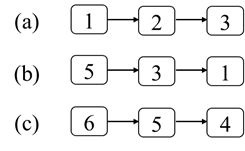
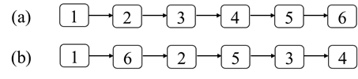

# 第四章：链表
## 面试题21：删除倒数第k个结点
### 题目
给你一个链表，请问如何删除链表中的倒数第k个结点？假设链表中结点的总数为n，那么1≤k≤n。要求只能遍历链表一次。
例如输入图4.1中（a）的链表，删除倒数第2个结点之后的链表如图4.1中（b）所示。
 


图4.1：从链表中删除倒数第2个结点。（a）一个包含6个结点的链表。（b）删除倒数第2个结点（值为5的结点）之后的链表。

### 参考代码
``` python
# Definition for singly-linked list.
# class ListNode:
#     def __init__(self, val=0, next=None):
#         self.val = val
#         self.next = next
class Solution:
    def removeNthFromEnd(self, head: ListNode, n: int) -> ListNode:
        dummy = ListNode(-1, head)
        fast = head
        while fast and n:
            fast = fast.next
            n -= 1
        if n: return None
        # if slow = head, final position is the node need deleted
        slow = dummy
        while fast:
            fast = fast.next
            slow = slow.next
        slow.next = slow.next.next
        return dummy.next
```

## 面试题22：链表中环的入口结点
### 题目
一个链表中包含环，如何找出环的入口结点？从链表的头结点开始沿着next指针进入环的第一个结点为环的入口结点。例如，在图4.3的链表中，环的入口结点是结点3。
 


图4.3：结点3是链表中环的入口结点

### 参考代码
``` python
# Definition for singly-linked list.
# class ListNode:
#     def __init__(self, x):
#         self.val = x
#         self.next = None

class Solution:
    def detectCycle(self, head: ListNode) -> ListNode:
        if not head or not head.next:
            return None
        slow = fast = head
        while fast and fast.next:
            fast = fast.next.next
            slow = slow.next
            if fast == slow:
                break
                
        if not fast or not fast.next:
            return None
        fast = head
        while slow != fast:
            slow = slow.next
            fast = fast.next
        return fast

    #假设链表环前有a个节点,环内有b个节点
    # 本题核心思路：走a+nb 步一定处于环的入口位置
    # 利用快慢指针 fast 和slow，fast 一次走两步，slow 一次走一步
    # 当两个指针第一次相遇时，假设 slow 走了 s 步，下面计算 fast 走过的步数
    # i. fast 比 slow 多走了 n 个环：f=s+nb
    # ii. fast 比slow 多走一倍的步数：f=2s --> 跟上式联立可得 s=nb
    # iii. 综上计算得，f=2nb，s=nb
    # 也就是两个指针第一次相遇时，都走过了环的倍数，那么再走 a 步就可以到达环的入口让 fast 从头再走，slow 留在原地，fast 和 slow 均一次走一步，当两个指针第二次相遇时，fast 走了a 步，slow 走了 a+nb 步此时 slow 就在环的入口处，返回slow
```

## 面试题23：两个链表的第一个重合结点
### 题目
输入两个单向链表，请问如何找出它们的第一个重合结点。例如图4.5中的两个链表的第一个重合的结点的值是4。
 


图4.5：两个部分重合的链表，它们的第一个重合的结点的值是4。

### 参考代码
#### 解法一
``` python
# Definition for singly-linked list.
# class ListNode:
#     def __init__(self, x):
#         self.val = x
#         self.next = None

#  same node must exist right side, once same next all same
class Solution:
    def getIntersectionNode(self, headA: ListNode, headB: ListNode) -> ListNode:
        def countList(head):
            cnt = 0
            while head:
                cnt += 1
                head = head.next
            return cnt
        
        countA = countList(headA)
        countB = countList(headB)
        if countA < countB: headA, headB = headB, headA
        n = abs(countA - countB)
        for i in range(n):
            headA = headA.next
        while headA != headB:
            headA = headA.next
            headB = headB.next
        return headA
```
#### 解法二
```python
# a + c + b = b + c + a
class Solution:
    def getIntersectionNode(self, headA: ListNode, headB: ListNode) -> ListNode:
        a, b = headA, headB
        while a != b:
            a = a.next if a else headB
            b = b.next if b else headA
        return a
```

## 面试题24：反转链表
### 题目
定义一个函数，输入一个链表的头结点，反转该链表并输出反转后链表的头结点。例如，把图4.8（a）中的链表反转之后得到的链表如图4.8（b）所示。
 


图4.8：反转一个链表。（a）一个含有5个结点的链表。（b）反转之后的链表。

### 参考代码
``` python
# Definition for singly-linked list.
# class ListNode:
#     def __init__(self, val=0, next=None):
#         self.val = val
#         self.next = next

# iteration 
class Solution:
    def reverseList(self, head: ListNode) -> ListNode:
        pre, cur = None, head
        while cur:
            temp = cur.next
            cur.next = pre
            pre = cur
            cur = temp
        return pre
```

```python
# recurse
class Solution:
    def reverseList(self, head: ListNode) -> ListNode:
        if not head or not head.next:
            return head
        newHead = self.reverseList(head.next)
        head.next.next = head
        head.next = None
        return newHead
```

## 面试题25：链表中的数字相加
### 题目
给你两个表示非负整数的单向链表，请问如何实现这两个整数的相加并且把和仍然用单向链表表示？链表中的每个结点表示整数十进制的一位，并且头结点对应整数的最高位数而尾结点对应整数的个位数。例如在图4.10（a）和（b）中的两个链表分别表示整数123和531，它们的和为654，对应的链表尾图4.10的（c）所示。
 


图4.10：链表中数字以及它们的和。（a）表示整数123的链表。（b）表示整数531的链表。（c）表示123与531的和654的链表。

### 参考代码
``` python
# Definition for singly-linked list.
# class ListNode:
#     def __init__(self, val=0, next=None):
#         self.val = val
#         self.next = next
class Solution:
    def addTwoNumbers(self, l1: ListNode, l2: ListNode) -> ListNode:
        stack1, stack2 = [], []
        head1, head2 = l1, l2
        while head1:
            stack1.append(head1.val)
            head1 = head1.next
        while head2:
            stack2.append(head2.val)
            head2 = head2.next
        
        carry = 0
        # dummy = ListNode()
        ans = None ###
        while stack1 or stack2:
            a = stack1.pop() if stack1 else 0
            b = stack2.pop() if stack2 else 0
            total = a + b + carry
            carry = total // 10
            total %= 10
            # if total >= 10:
            #     total %= 10
            #     carry = 1
            node = ListNode(total)
            node.next = ans
            ans = node
        if carry:
            node = ListNode(carry)
            node.next = ans
            ans = node
        return ans
```

```python
class Solution:
    def addTwoNumbers(self, l1: ListNode, l2: ListNode) -> ListNode:
        def reverseList(head):
            if not head or not head.next:
                return head
            newHead = reverseList(head.next)
            head.next.next = head
            head.next = None
            return newHead

        head1 = reverseList(l1)
        head2 = reverseList(l2)
        newHead = None
        carry = 0
        while head1 or head2:
            a = head1.val if head1 else 0
            b = head2.val if head2 else 0
            cur = a + b + carry
            carry = cur // 10
            cur %= 10
            curNode = ListNode(cur)
            curNode.next = newHead
            newHead = curNode
            if head1: head1 = head1.next
            if head2: head2 = head2.next
        if carry:
            curNode = ListNode(carry)
            curNode.next = newHead
            newHead = curNode
        return newHead
```

## 面试题26：重排链表
### 题目
给你一个链表，链表中结点的顺序是L0→ L1→ L2→…→ Ln-1→ Ln，请问如何重排链表使得结点的顺序变成L0→ Ln→ L1→ Ln-1→ L2→ Ln-2→…？例如输入图4.12（a）中的链表，重排之后的链表如图4.12（b）所示。
 


图4.12：重排链表。（a）一个含有6个结点的链表。（b）重排之后的链表。

### 参考代码
``` python
# Definition for singly-linked list.
# class ListNode:
#     def __init__(self, val=0, next=None):
#         self.val = val
#         self.next = next
class Solution:
    def reorderList(self, head: ListNode) -> None:
        """
        Do not return anything, modify head in-place instead.
        """
        def reverse(head):
            if not head or not head.next:
                return head
            newHead = reverse(head.next)
            head.next.next = head
            head.next = None
            return newHead
        
        slow = fast = head
        while fast and fast.next:
            slow = slow.next
            fast = fast.next.next
        second = slow.next
        slow.next = None ###

        first = head
        second = reverse(second) ###
        dummy = ListNode(-1, None)
        cur = dummy

        while first and second:
            temp = first.next
            cur.next = first
            cur = cur.next
            cur.next = second
            cur = cur.next

            first = temp  ###
            second = second.next ###
        
        if first:
            cur.next = first
        return dummy.next
```

## 面试题27：回文链表
### 题目
如何判断一个链表是不是回文？要求解法的时间复杂度是O(n)，另外不得使用超过O(1)的辅助空间。如果一个链表是回文，那么链表中结点序列从前往后看和从后往前看是相同的。例如，图4.13中的链表的结点序列从前往后看和从后往前看都是1、2、3、3、2、1，因此这是一个回文链表。
 


图4.13：一个回文链表。

### 参考代码
``` python
# Definition for singly-linked list.
# class ListNode:
#     def __init__(self, val=0, next=None):
#         self.val = val
#         self.next = next
class Solution:
    def isPalindrome(self, head: ListNode) -> bool:
        def reverse(head):
            pre, cur = None, head
            while cur:
                temp = cur.next
                cur.next = pre
                pre = cur
                cur = temp
            return pre

        slow = fast = dummy = ListNode(-1, head)
        while fast and fast.next:
            slow = slow.next
            fast = fast.next.next
        second = slow.next
        first = head
        slow.next = None
        second = reverse(second)
        while second:
            if second.val != first.val:
                return False
            second = second.next
            first = first.next
        
        return True
```

## 面试题28：展平多级双向链表
### 题目
在一个多级双向链表中节点除了有两个指针分别指向前后两个节点之外，还有一个指针指向它的子链表，并且子链表也是一个双向链表，它的节点也有指向子链表的指针。请将这样的多级双向链表展平成普通的双向链表，即所有节点都没有子链表。例如图4.14（a）是一个多级双向链表，它展平之后如图4.14（b）所示。
 


图4.14：展平多级双向链表。（a）一个多级双向链表。（b）展平之后的双向链表。

### 参考代码
``` java
public Node flatten(Node head) {
    flattenGetTail(head);
    return head;
}

private Node flattenGetTail(Node head) {
    Node node = head;
    Node tail = null;
    while (node != null) {
        Node next = node.next;
        if (node.child != null) {
            Node child = node.child;
            Node childTail = flattenGetTail(node.child);

            node.child = null;
            node.next = child;
            child.prev = node;
            childTail.next = next;
            if (next != null) {
                next.prev = childTail;
            }

            tail = childTail;
        } else {
            tail = node;                
        }

        node = next;
    }

    return tail;
}
```

## 面试题29：排序的循环链表
### 题目
在一个循环链表中节点的值递增排序，请设计一个算法往该循环链表中插入节点，并保证插入节点之后的循环链表仍然是排序的。例如图4.15（a）是一个排序的循环链表，插入一个值为4的节点之后的链表如图4.15（b）所示。
 


图4.15：往排序的循环链表中插入节点。（a）一个值分别为1、2、3、5、6的循环链表。（b）往链表中插入值为4的节点。

### 参考代码
``` java
public Node insert(Node head, int insertVal) {
    Node node = new Node(insertVal);
    if (head == null) {
        head = node;
        head.next = head;
    } else if (head.next == head) {
        head.next = node;
        node.next = head;
    } else {
        insertCore(head, node);
    }

    return head;
}

private void insertCore(Node head, Node node) {
    Node cur = head;
    Node next = head.next;
    Node biggest = head;
    while (!(cur.val <= node.val && next.val >= node.val)
            && next != head) {
        cur = next;
        next = next.next;
        if (cur.val >= biggest.val)
            biggest = cur;
    }

    if (cur.val <= node.val && next.val >= node.val) {
        cur.next = node;
        node.next = next;
    } else {
        node.next = biggest.next;
        biggest.next = node;
    }
}    
```
