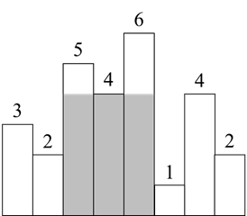
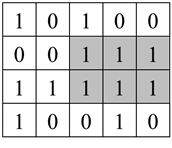

# 第六章：栈
## 面试题36：后缀表达式
### 题目
后缀表达式是一种算术表达式，它的操作符在操作数的后面。输入一个用字符串数组表示的后缀表达式，请输出该后缀表达式的计算结果。假设输入的一定是有效的后缀表达式。例如，后缀表达式["2", "1", "3", "*", "+"]对应的算术表达式是“2 + 1 * 3”，因此输出它的计算结果5。

### 参考代码
``` python
class Solution:
    def evalRPN(self, tokens: List[str]) -> int:
        stack = []
        for token in tokens:
            if token not in "+-*/":
                stack.append(int(token))
            else:
                b = stack.pop()
                a = stack.pop()
                if token == '+':
                    c = a + b
                elif token == '-':
                    c = a - b
                elif token == '*':
                    c = a * b
                else:
                    c = int(a / b)
                stack.append(c)
        return stack[0]
```

## 面试题37：小行星碰撞
### 题目
输入一个表示小行星的数组，数组中每个数字的绝对值表示小行星的大小，数字的正负号表示小行星运动的方向，正号表示向右飞行，负号表示向左飞行。如果两个小行星相撞，体积较小的小行星将会爆炸最终消失，体积较大的小行星不受影响。如果相撞的两个小行星大小相同，它们都会爆炸。飞行方向相同的小行星永远不会相撞。求最终剩下的小行星。例如，假如有六个小行星[4, 5, -6, 4, 8, -5]（如图6.2所示），它们相撞之后最终剩下三个小行星[-6, 4, 8]。
 


图6.2：用数组[4, 5, -6, 4, 8, -5]表示的六个小行星。箭头表示飞行的方向。

### 参考代码
``` python
class Solution:
    def asteroidCollision(self, asteroids: List[int]) -> List[int]:
        stack = []
        for asteroid in asteroids:
            while stack and stack[-1] > 0 and stack[-1] < -asteroid:
                stack.pop()

            if stack and asteroid < 0 and stack[-1] == -asteroid:
                stack.pop()
            elif not stack or stack[-1] < 0 or asteroid > 0:
                stack.append(asteroid)
        return stack
```

## 面试题38：每日温度
### 题目
输入一个数组，它的每个数字是某天的温度。请计算在每一天需要等几天才会有更高的温度。例如，如果输入数组[35, 31, 33, 36, 34]，那么输出为[3, 1, 1, 0, 0]。由于第一天的温度是35，要等3天才会有更高的温度36，因此对应的输出为3。第四天的温度是36，后面没有更高的温度，它对应的输出是0。

### 参考代码
``` python
class Solution:
    def dailyTemperatures(self, temperatures: List[int]) -> List[int]:
        n = len(temperatures)
        res = [0] * n
        stack = []
        for i in range(n):
            # while stack and temperatures[i] > stack[-1]:
            while stack and temperatures[i] > temperatures[stack[-1]]: ###
                idx = stack.pop()
                res[idx] = i - idx
            stack.append(i)
        return res
```

## 面试题39：直方图最大矩形面积
### 题目
直方图是由排列在同一基线上的相邻柱子组成的图形。输入一个由非负数组成的数组，数组中的数字是直方图宽为1的柱子的高。求直方图中最大矩形的面积。例如，输入数组[3, 2, 5, 4, 6, 1, 4, 2]，它对应的直方图如图6.3所示。该直方图中最大的矩形的面积为12，如阴影部分所示。
 


图6.3：柱子高度分别为[3, 2, 5, 4, 6, 1, 4, 2]的直方图，其中最大的矩形的面积是12，如阴影部分所示。

### 参考代码
#### 解法一
``` python
class Solution:
    def largestRectangleArea(self, heights: List[int]) -> int:
        n = len(heights)
        res = 0
        for i in range(n):
            h = heights[i]
            for j in range(i, n):
                h = min(h, heights[j])
                res = max(res, (j - i + 1) * h )
        return res
```

#### 解法二
``` python
class Solution:
    def largestRectangleArea(self, heights: List[int]) -> int:
        def helper(start, end):
            if start == end:
                return heights[start]
            if start > end:
                return 0
            minIdx = start
            for i in range(start + 1, end + 1):
                if heights[i] < heights[minIdx]:
                    minIdx = i
                    
            area = (end - start + 1) * heights[minIdx]
            left = helper(start, minIdx - 1)
            right = helper(minIdx + 1, end)
            return max(area, left, right)

        return helper(0, len(heights) - 1)
```
#### 解法三
``` python
# 单调递增栈
class Solution:
    def largestRectangleArea(self, heights: List[int]) -> int:
        stack = [-1]
        res = 0
        n = len(heights)
        for i in range(n):
            while stack[-1] != -1 and heights[i] <= heights[stack[-1]]:
                idx = stack.pop()
                # 此时栈顶是左边高度小于height[idx]的坐标, 右边小于height[idx]的是i
                # 计算以idx为最低高低的面积
                res = max(res, heights[idx] * (i - 1 - stack[-1])) 
            stack.append(i)

        while stack[-1] != -1:
            h = heights[stack.pop()]
            w = n - 1 - stack[-1]
            res = max(res, h * w)
        return res
```

## 面试题40：矩阵中最大的矩形
### 题目
请在一个由0、1组成的矩阵中找出最大的只包含1的矩形并输出它的面积。例如在图6.6的矩阵中，最大的只包含1的矩阵如阴影部分所示，它的面积是6。
 


图6.6：一个由0、1组成的矩阵，其中只包含1的最大矩形的面积为6，如阴影部分所示。

### 参考代码
``` python
class Solution:
    def maximalRectangle(self, matrix: List[str]) -> int:
        def largestRectangleArea(heights: List[int]):
            stack = [-1]
            res = 0
            n = len(heights)
            for i in range(n):
                while stack[-1] != -1 and heights[i] <= heights[stack[-1]]:
                    idx = stack.pop()
                    res = max(res, heights[idx] * (i - 1 - stack[-1]))
                stack.append(i)

            while stack[-1] != -1:
                h = heights[stack.pop()]
                w = n - 1 - stack[-1]
                res = max(res, h * w)
            return res

        if not matrix or not matrix[0]: return 0
        m, n = len(matrix), len(matrix[0])
        heights = [0] * n
        maxArea = 0
        for i in range(m):
            for j in range(n):
                if matrix[i][j] == '0':
                    heights[j] = 0
                else:
                    heights[j] += 1
            maxArea = max(maxArea, largestRectangleArea(heights))
        return maxArea
```
