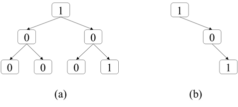
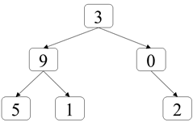
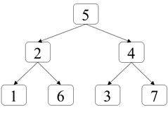
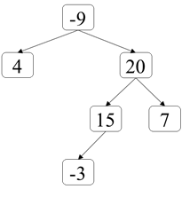
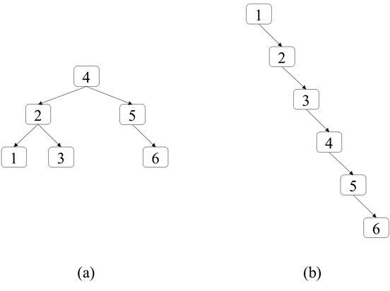
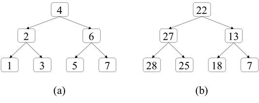
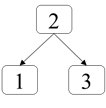
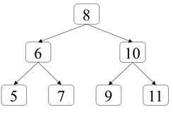

# 第八章：树
## 面试题47：二叉树剪枝
### 题目
一个二叉树的所有结点的值要么是0要么是1，请剪除该二叉树中所有结点的值全都是0 的子树。例如，在剪除图8.2（a）中二叉树中所有结点值都为0的子树之后的结果如图8.2（b）所示。
 


图8.2：剪除所有结点值都为0的子树。（a）一个结点值要么是0要么是1的二叉树。（b）剪除所有结点值都为0的子树的结果。

### 参考代码
``` python
class Solution:
    def pruneTree(self, root: TreeNode) -> TreeNode:
        if not root:
            return None
        root.left = self.pruneTree(root.left)
        root.right = self.pruneTree(root.right)
        if not root.left and not root.right and root.val == 0:
            return None
        return root
```

## 面试题48：序列化和反序列化二叉树
### 题目
请设计一个算法能将二叉树序列化成一个字符串并能将该字符串反序列化出原来二叉树的算法。

### 参考代码
``` python
class Codec:

    def serialize(self, root):
        if not root:
            return '#'
        leftStr = self.serialize(root.left)
        rightStr = self.serialize(root.right)
        return str(root.val) + ',' + leftStr + ',' + rightStr
        

    def deserialize(self, data):
        def dfs():
            ch = nodeStrs[self.idx]
            self.idx += 1
            if ch == '#': return None
            root = TreeNode(int(ch))
            root.left = dfs()
            root.right = dfs()
            return root

        nodeStrs = data.split(',')
        self.idx = 0
        return dfs()
```

## 面试题49：从根结点到叶结点的路径数字之和

### 题目
在一个二叉树里所有结点都在0-9的范围之类，从根结点到叶结点的路径表示一个数字。求二叉树里所有路径表示的数字之和。例如在图8.4中的二叉树有三条从根结点到叶结点的路径，它们分别表示数字395、391和302，这三个数字之和是1088。
 


图8.4：一个从根结点到叶结点的路径分别表示数字395、391和302的二叉树。

### 参考代码
``` python
class Solution:
    def sumNumbers(self, root: TreeNode) -> int:
        def dfs(root, path):
            if not root:
                return 0
            path = path * 10 + root.val
            if not root.left and not root.right:
                return path
            return dfs(root.left, path) + dfs(root.right, path)   
        
        return dfs(root, 0)
```

## 面试题50：向下的路径结点之和
### 题目
给定一个二叉树和一个值sum，求二叉树里结点值之和等于sum的路径的数目。路径的定义为二叉树中沿着指向子结点的指针向下移动所经过的结点，但不一定从根结点开始，也不一定到叶结点结束。例如在图8.5中的二叉树里，有两个路径的结点值之和等于8，其中第一条路径从结点5开始经过结点2到达结点1，第二条路径从结点2开始到结点6。
 

 
图8.5：二叉树中有两条路径上的结点值之和等于8，第一条路径从结点5开始经过结点2到达结点1，第二条路径从结点2开始到结点6。

### 参考代码
``` python
class Solution:
    def pathSum(self, root: TreeNode, targetSum: int) -> int:
        def dfs(root, path):
            if not root:
                return
            path += root.val
            self.ans += sumCount.get(path - targetSum, 0)
            sumCount[path] = sumCount.get(path, 0) + 1
            dfs(root.left, path)
            dfs(root.right, path)
            sumCount[path] -= 1

        self.ans = 0
        sumCount = {0 : 1}
        dfs(root, 0)
        return self.ans
```

## 面试题51：结点之和最大的路径
### 题目
在二叉树中定义路径为从沿着结点间的连接从任意一个结点开始到达任意一个结点所经过的所有结点。路径中至少包含一个结点，不一定经过二叉树的根结点，也不一定经过叶结点。给你非空的一个二叉树，请求出二叉树所有路径上结点值之和的最大值。例如在图8.6中的二叉树中，从结点15开始经过结点20到达结点7的路径是结点值之和为42，是结点值之和最大的路径。
 


图8.6：在二叉树中，从结点15开始经过结点20到达结点7的路径是结点值之和为42，是结点值之和最大的路径。

### 参考代码
``` python
class Solution:
    def maxPathSum(self, root: TreeNode) -> int:
        def dfs(root):
            if not root: return 0
            left = dfs(root.left)
            right = dfs(root.right)
            self.ans = max(self.ans, max(left, 0) + max(right, 0) + root.val) ###
            return root.val + max(left, right, 0)

        self.ans = -sys.maxsize ###
        dfs(root)
        return self.ans
```

## 面试题52：展平二叉搜索树
### 题目
给你一个二叉搜索树，请调整结点的指针使得每个结点都没有左子结点看起来像一个链表，但新的树仍然是二叉搜索树。例如把图8.8（a）中的二叉搜索树按照这个规则展平之后的结果如图8.8（b）所示。
 


图8.8：把二叉搜索树展平成链表。（a）一个有6个结点的二叉树。（b）展平成看起来是链表的二叉搜索树，每个结点都没有左子结点。

### 参考代码
``` python
class Solution:
    def increasingBST(self, root: TreeNode) -> TreeNode:
        dummy = TreeNode()
        pre = dummy
        cur = root
        stack = []
        while stack or cur:
            while cur:
                stack.append(cur)
                cur = cur.left
            cur = stack.pop()
            pre.right = cur
            cur.left = None ###
            pre = pre.right
            cur = cur.right
        return dummy.right
```

```python
class Solution:
    def increasingBST(self, root: TreeNode) -> TreeNode:
        def inorder(root):
            if not root: return root
            inorder(root.left)
            self.pre.right = root
            root.left = None
            self.pre = self.pre.right
            inorder(root.right)

        dummy = TreeNode()
        self.pre = dummy
        inorder(root)
        return dummy.right

```
## 面试题53：二叉搜索树的下一个结点

### 题目
给你一个二叉搜索时和它的一个结点p，请找出按中序遍历的顺序该结点p的下一个结点。假设二叉搜索树中结点的值都是唯一的。例如在图8.9的二叉搜索树中，结点8的下一个结点是结点9，结点11的下一个结点是null。
 


图8.9：在二叉搜索树中，按照中序遍历的顺序结点8的下一个结点是结点9，结点11的下一个结点是null。

### 参考代码
#### 解法一
``` python
# Definition for a binary tree node.
# class TreeNode:
#     def __init__(self, x):
#         self.val = x
#         self.left = None
#         self.right = None

class Solution:
    def inorderSuccessor(self, root: 'TreeNode', p: 'TreeNode') -> 'TreeNode':
        if not root:
            return None
        stack = []
        cur = root
        found = False
        while stack or cur:
            while cur:
                stack.append(cur)
                cur = cur.left
            cur = stack.pop()
            if found:
                return cur
            if not found and cur == p:
                found = True
            cur = cur.right
        return None
```
 
#### 解法二
``` python
class Solution:
    def inorderSuccessor(self, root: 'TreeNode', p: 'TreeNode') -> 'TreeNode':
        cur = root
        res = None
        while cur:
            if cur.val > p.val:
                res = cur
                cur = cur.left
            else:
                cur = cur.right
        return res
```

## 面试题54：所有大于等于结点的值之和
### 题目
给你一个二叉搜索树，请将它的每个结点的值替换成树中大于或者等于该结点值的所有结点值之和。假设二叉搜索树中结点的值唯一。例如，输入图8.10（a）中的二叉搜索树，由于有两个结点的值大于或者等于6（即结点6和结点7），因此值为6结点的值替换成13，其他结点的值的替换过程类似，所有结点的值替换之后的结果如图8.10（b）所示。
 


图8.10：把二叉搜索树中每个结点的值替换成树中大于或者等于该结点值的所有结点值之和。（a）一个二叉搜索树。（b）替换之后的二叉树。

### 参考代码
``` python
class Solution:
    def convertBST(self, root: TreeNode) -> TreeNode:
        cur = root
        stack = []
        presum = 0
        while stack or cur:
            while cur:
                stack.append(cur)
                cur = cur.right
            cur = stack.pop()
            cur.val += presum
            presum = cur.val
            cur = cur.left
        return root
```

## 面试题55：二叉搜索树迭代器
### 题目
请实现二叉搜索树的迭代器BSTIterator，它主要有如下三个函数：
+ 构造函数输入一个二叉搜索树的根结点初始化该迭代器；
+ 函数next返回二叉搜索树中下一个最小的结点的值；
+ 函数hasNext返回二叉搜索树是否还有下一个结点。

例如输入图8.11中的二叉树搜索树初始化BSTIterator，第一次调用函数next将返回最小的结点值1，此时调用函数hasNext返回true。再次调用函数next将返回下一个最小的结点的值2，此时再调用函数hasNext将返回true。第三次调用函数next将返回下一个最小的结点的值3，如果此时再调用函数hasNext将返回false。
 

 
图8.11：一个有3个结点的二叉搜索树。

### 参考代码
``` python
class BSTIterator:

    def __init__(self, root: TreeNode):
        self.cur = root
        self.stack = []

    def next(self) -> int:
        while self.cur:
            self.stack.append(self.cur)
            self.cur = self.cur.left
        self.cur = self.stack.pop()
        val = self.cur.val
        self.cur = self.cur.right
        return val

    def hasNext(self) -> bool:
        if self.stack or self.cur:
            return True
        return False
```

```python
class BSTIterator:

    def __init__(self, root: TreeNode):
        self.stack = []
        cur = root
        # while self.stack or cur:
        while cur:
            self.stack.append(cur)
            cur = cur.left

    def next(self) -> int:
        if not self.stack: return -1
        res = cur = self.stack.pop()
        # while self.stack or cur:
        cur = cur.right
        while cur:
            self.stack.append(cur)
            cur = cur.left
        return res.val

    def hasNext(self) -> bool:
        return len(self.stack) != 0
```

## 面试题56：二叉搜索树中两个结点之和
### 题目
给你一个二叉搜索树和一个值k，请判断该二叉搜索树中是否存在两个结点它们的值之和等于k。假设二叉搜索树中结点的值均唯一。例如在图8.12中的二叉搜索树里，存在两个两个结点它们的和等于12（结点5和结点7），但不存在两个结点值之和为22的结点。 
 

 
图8.12：在二叉搜索树中，存在两个结点它们的和等于12（结点5和结点7），但不存在两个结点值之和为22的结点。

### 参考代码
``` python
class Solution:
    def findTarget(self, root: TreeNode, k: int) -> bool:
        visited = set()
        stack = []
        cur = root
        while stack or cur:
            while cur:
                stack.append(cur)
                cur = cur.left
            cur = stack.pop()
            if k - cur.val in visited:
                return True
            visited.add(cur.val)
            cur = cur.right
        return False
```

```python
class BSTIterator:
    def __init__(self, root):
        self.stack = []
        cur = root
        while cur:
            self.stack.append(cur)
            cur = cur.left

    def hasNext(self):
        return len(self.stack) != 0

    def next(self):
        res = cur = self.stack.pop()
        cur = cur.right
        while cur:
            self.stack.append(cur)
            cur = cur.left
        return res.val

class ReversedBSTIterator:
    def __init__(self, root):
        self.stack = []
        cur = root
        while cur:
            self.stack.append(cur)
            cur = cur.right

    def hasNext(self):
        return len(self.stack) != 0

    def prev(self):
        res = cur = self.stack.pop()
        cur = cur.left
        while cur:
            self.stack.append(cur)
            cur = cur.right
        return res.val

class Solution:
    def findTarget(self, root: TreeNode, k: int) -> bool:
        iterator = BSTIterator(root)
        reversedIterator = ReversedBSTIterator(root)
        p = iterator.next()
        q = reversedIterator.prev()
        while p != q:
            if p + q == k:
                return True
            elif p + q < k:
                p = iterator.next()
            else:
                q = reversedIterator.prev()
        return False
```

## 面试题57：值和下标之差都在给定的范围内
### 题目
给你一个整数数组nums，请判断是否存在两个不同的下标i和j（i和j之差的绝对值不大于给定的k）使得两个数值nums[i]和nums[j]的差的绝对值不大于给定的t。例如，如果输入数组{1, 2, 3, 1}，k为3，t为0，由于下标0和下标3，它们对应的数字之差的绝对值为0，因此返回true。如果输入数组{1, 5, 9, 1, 5, 9}，k为2，t为3，由于不存在两个下标之差小于等于2的数字它们差的绝对值小于等于3，此时应该返回false。

### 参考代码
#### 解法一
``` python
from sortedcontainers import SortedSet
class Solution:
    def containsNearbyAlmostDuplicate(self, nums: List[int], k: int, t: int) -> bool:
        n = len(nums)
        st = SortedSet()
        i = 0
        #  i < j, if nums[j] - nums[i] <= t, exist nums[i] >= nums[j] - t
        #  sortedset [5, 9]  input 1, k = 2, t = 3
        #  bisect_left(st, 1 - 3), idx = 0, but 5 - 1 > t
        for j in range(n):
            idx = bisect.bisect_left(st, nums[j] - t)
            # if idx != len(st) and abs(nums[i] - nums[j]) <= t:
            if idx != len(st) and abs(st[idx] - nums[j]) <= t:
                return True
            st.add(nums[j])
            if j >= k:
                st.remove(nums[i])
                i += 1
        return False
```

#### 解法二
``` python
class Solution:
    def containsNearbyAlmostDuplicate(self, nums: List[int], k: int, t: int) -> bool:
        def getBucketIdx(n, bucketSize):
            if n >= 0:
                return n // bucketSize
            else:
                # ((n + 1) // bucketSize) - 1
                return (n + 1) // bucketSize - 1
        # each bucket contains one key
        buckets = {} # bucketid : num
        bucketSize = t + 1
        for i in range(len(nums)):
            num = nums[i]
            idx = getBucketIdx(num, bucketSize)
            if idx in buckets:
                return True
            if idx - 1 in buckets and abs(buckets[idx - 1] - nums[i]) <= t:
                return True
            if idx + 1 in buckets and abs(buckets[idx + 1] - nums[i]) <= t:
                return True
            buckets[idx] = num

            if i >= k:
                buckets.pop(getBucketIdx(nums[i - k], bucketSize))
        return False
```

## 面试题58：日程表
### 题目
请实现一个类型MyCalendar用来记录你的日程安排，该类型有一个方法book(int start, int end)往日程安排表里添加一个时间区域为[start, end)的事项（这是个半开半闭区间，即start<=x<end）。如果[start, end)内没有事先安排其他事项，则成功添加该事项并返回true。否则不能添加该事项，并返回false。

例如，在下面的三次调用book方法中，第二次调用返回false，这是因为时间[15, 20)已经被第一次调用预留了。由于第一次占用的时间是个半开半闭区间，并没有真正占用时间20，因此不影响第三次调用预留时间区间[20, 30)。 
``` java
MyCalendar cal = new MyCalendar()；
cal.book(10, 20); // returns true
cal.book(15, 25); // returns false
cal.book(20, 30); // returns true
```

### 参考代码
``` python
from sortedcontainers import SortedList
class MyCalendar:

    def __init__(self):
        self.calendar = SortedList()


    def book(self, start: int, end: int) -> bool:
        # idx = bisect.bisect_left(self.calendar, start)
        idx = bisect.bisect_right(self.calendar, start)
        if idx == len(self.calendar) or idx % 2 == 0 and self.calendar[idx] >= end:
            self.calendar.add(start)
            self.calendar.add(end)
            return True
        return False
```
