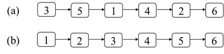
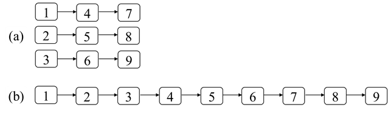

# 第十二章：排序
## 面试题74：合并区间
### 题目
输入一个区间的集合，请将重叠的区间合并。每个区间用两个数字比较，分别表示区间的起始和结束位置。例如，输入区间[[1, 3], [4, 5], [8, 10], [2, 6], [9, 12], [15, 18]]，合并重叠的区间之后得到[[1, 6], [8, 12], [15, 18]]。

### 参考代码
``` python
class Solution:
    def merge(self, intervals: List[List[int]]) -> List[List[int]]:
        intervals.sort(key = lambda x : x[0])
        merged = []
        for interval in intervals:
            if not merged or merged[-1][1] < interval[0]:
                merged.append(interval)
            else:
                merged[-1][1] = max(merged[-1][1], interval[1])
        return merged
```

## 面试题75：数组相对排序
### 题目
输入两个数组arr1和arr2，其中arr2里的每个数字都唯一并且也都是arr1中的数字。请将arr1中的数字按照arr2中数字的相对顺序排序。如果arr1中的数字在arr2中没有出现，那么将这些数字按递增的顺序排在后面。假设数组中的所有数字都在0到1000的范围内。例如，输入的数组arr1和arr2分别是[2, 3, 3, 7, 3, 9, 2, 1, 7, 2]和[3, 2, 1]，则arr1排序之后为[3, 3, 3, 2, 2, 2, 1, 7, 7, 9]。

### 参考代码
``` python
class Solution:
    def relativeSortArray(self, arr1: List[int], arr2: List[int]) -> List[int]:
        count = [0] * 1001
        for num in arr1:
            count[num] += 1
        i = 0
        for num in arr2:
            while count[num] > 0:
                arr1[i] = num
                count[num] -= 1
                i += 1

        for num in range(1001):
            while count[num] > 0:
                arr1[i] = num
                i += 1
                count[num] -= 1
        return arr1
```

## 面试题76：数组中第k大的数字
### 题目
请从一个乱序的数组中找出第k大的数字。例如数组[3, 1, 2, 4, 5, 5, 6]中第3大的数字是5。

### 参考代码
``` python
class Solution:
    def findKthLargest(self, nums: List[int], k: int) -> int:
        def partition(lo, hi):
            idx = random.randint(lo, hi)
            nums[idx], nums[hi] = nums[hi], nums[idx]
            pivot = nums[hi]
            i = lo
            for j in range(lo, hi):
                if nums[j] > pivot:
                    nums[i], nums[j] = nums[j], nums[i]
                    i += 1
            nums[i], nums[hi] = nums[hi], nums[i]
            return i

        if len(nums) < k: return -1
        lo, hi = 0, len(nums) - 1
        idx = partition(lo, hi)
        while idx != k - 1:
            if idx < k - 1:
                lo = idx + 1
            else:
                hi = idx - 1
            idx = partition(lo, hi)
        return nums[idx]
```

## 面试题77：链表排序
### 题目
输入一个链表的头节点，请将该链表排序。例如，输入图12.4（a）中的链表，该链表排序后如图12.4（b）所示。
 


图12.4：链表排序。（a）一个有6个结点的链表。（b）排序后的链表。

### 参考代码
``` python
# Definition for singly-linked list.
# class ListNode:
#     def __init__(self, val=0, next=None):
#         self.val = val
#         self.next = next
class Solution:
    def sortList(self, head: ListNode) -> ListNode:
        def merge(head1, head2):
            dummy = cur = ListNode()
            while head1 and head2:
                if head1.val < head2.val:
                    cur.next = head1
                    head1 = head1.next
                else:
                    cur.next = head2
                    head2 = head2.next
                cur = cur.next
            cur.next = head1 or head2
            return dummy.next

        def split(head):
            slow, fast = head, head.next ### fast = head.next
            while fast and fast.next:
                slow = slow.next
                fast = fast.next.next
            mid = slow.next ###
            slow.next = None ###
            return mid

        if not head or not head.next:
            return head
        mid = split(head)
        left = self.sortList(head)
        right = self.sortList(mid)
        return merge(left, right)
```

```python
class Solution:
    def sortList(self, head: ListNode) -> ListNode:
        def merge(head1, head2):
            dummy = tail = ListNode()
            while head1 and head2:
                if head1.val < head2.val:
                    tail.next = head1
                    head1 = head1.next
                else:
                    tail.next = head2
                    head2 = head2.next
                tail = tail.next
            tail.next = head1 or head2
            while tail.next: tail = tail.next
            return [dummy.next, tail]
        
        def split(head, n):
            n -= 1 ###
            while n and head:
                head = head.next
                n -= 1
            rest = head.next if head else None
            # head :end of previous should disconnect
            if head: head.next = None
            return rest

        if not head or not head.next: return head
        cnt = 0
        node = head
        while node:
            cnt += 1
            node = node.next
        dummy = ListNode()
        dummy.next = head
        n = 1
        while n < cnt:
            cur = dummy.next
            tail = dummy
            while cur:
                l = cur
                r = split(l, n)
                cur = split(r, n)
                merged = merge(l, r)
                tail.next = merged[0]
                tail = merged[1]
            n <<= 1
        return dummy.next
```

## 面试题78：合并排序链表
### 题目
输入k个排序的链表，请将它们合并成一个排序的链表。例如，输入三个排序的链表如图12.5（a）所示，将它们合并之后得到的排序的链表如图12.5（b）所示。



图12.5：合并排序链表。（a）三个排序的链表。（b）合并后的链表。

### 参考代码
#### 解法一
``` python
class Solution:
    def mergeKLists(self, lists: List[ListNode]) -> ListNode:
        def merge(head1, head2):
            dummy = cur = ListNode()
            while head1 and head2:
                if head1.val < head2.val:
                    cur.next = head1
                    head1 = head1.next
                else:
                    cur.next = head2
                    head2 = head2.next
                cur = cur.next
            cur.next = head1 or head2
            return dummy.next
        
        if not lists: return None
        if len(lists) == 1: return lists[0]
        mid = len(lists) // 2
        l = self.mergeKLists(lists[:mid])
        r = self.mergeKLists(lists[mid:])
        return merge(l, r)
```
 
#### 解法二
``` python
class Solution:
    def mergeKLists(self, lists: List[ListNode]) -> ListNode:
        heap = []
        cnt = 0
        for node in lists:
            if node:
                cnt += 1
                heapq.heappush(heap, [node.val, cnt, node])
                node = node.next ###

        dummy = cur = ListNode()
        while heap:
            cur.next = heapq.heappop(heap)[2]
            cur = cur.next
            # if cur:
            if cur.next:
                cnt += 1
                # heapq.heappush(heap, [cur.val, cnt, cur])
                heapq.heappush(heap, [cur.next.val, cnt, cur.next])
        return dummy.next
```
#### 解法三
```python
class Solution:
    def mergeKLists(self, lists: List[ListNode]) -> ListNode:
        heap = []
        k = len(lists)
        for i in range(k):
            if lists[i]:
                heapq.heappush(heap, [lists[i].val, i, lists[i]])
                lists[i] = lists[i].next

        dummy = cur = ListNode()
        while heap:
            _, idx, cur.next = heapq.heappop(heap)
            cur = cur.next
            if cur.next:
                heapq.heappush(heap, [cur.next.val, idx, cur.next])
        return dummy.next

```