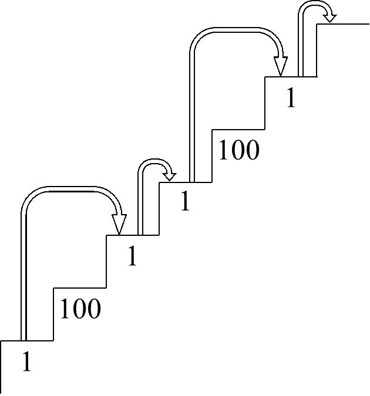
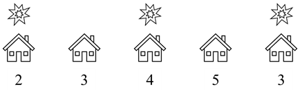
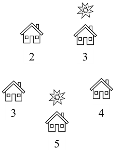
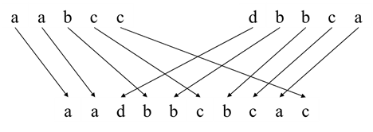
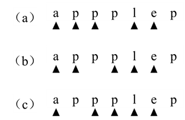
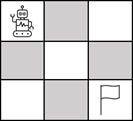
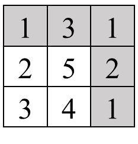
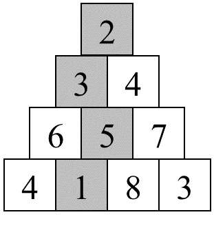

# 第十四章：动态规划
## 面试题88：爬楼梯的最少成本
### 题目
一个数组cost的所有数字都是正数，它的第i个数字表示在一个楼梯的第i级台阶往上爬的成本，在支付了成本cost[i]之后我们可以从第i级台阶往上爬1级或者2级。假设台阶至少有两级，我们可以从第0级台阶出发，也可以从第1级台阶出发，请计算爬上该楼梯的最少成本。例如输入数组[1, 100, 1, 1, 100, 1]，则爬上该楼梯的最少成本是4，分别经过下标为0、2、3、5这四级台阶，如图14.1所示。 
 


图14.1： 一个楼梯爬上每级台阶的成本用数组[1, 100, 1, 1, 100, 1]表示，爬上该台阶的最少成本为4，分别经过下标为0、2、3、5四级台阶。

### 参考代码
#### 解法一
``` python
class Solution:
    def minCostClimbingStairs(self, cost: List[int]) -> int:
        n = len(cost)
        dp = [0] * (n + 1) # dp[i] cost of climbing to no.i stair
        dp[0] = dp[1] = 0
        for i in range(2, n + 1):
            dp[i] = min(dp[i - 1] + cost[i - 1], dp[i - 2] + cost[i - 2])
        return dp[n]
```

#### 解法二
``` python
class Solution:
    def minCostClimbingStairs(self, cost: List[int]) -> int:
        n = len(cost)
        dpi0, dpi1 = 0, 0
        for i in range(2, n + 1):
            # dpi = min(dpi1 + cost[i - 1], dpi2 + cost[i - 2])
            # dpi1, dpi2 = dpi, dpi1
            dpi1, dpi0 = min(dpi1 + cost[i - 1], dpi0 + cost[i - 2]), dpi1
        return dpi1
```

#### 解法三
``` python
class Solution:
    def minCostClimbingStairs(self, cost: List[int]) -> int:
        def dp(n):
            if n <= 1: return 0
            if cache[n] < 0:
                cache[n] = min(dp(n - 1) + cost[n - 1], dp(n - 2) + cost[n - 2])
            return cache[n]


        n = len(cost)
        cache = [-1] * (n + 1)
        return dp(n)
```

## 面试题89：房屋偷盗
### 题目
输入一个数组表示某条街上的一排房屋内财产的数量。如果这条街道上相邻的两家被盗就会自动触发报警系统。一个小偷打算到给街去偷窃，请计算该小偷最多能偷到多少财产。例如，街道上五家的财产用数组[2, 3, 4, 5, 3]表示，如果小偷到下标为1、2和4的房屋内偷窃，那么他能偷取到价值9的财物，这是他在不触发报警系统情况下能偷取到的最多的财物，如图14.3所示。
 


图14.3： 一条街道上有5个财产数量分别为2、3、4、5、3的家庭。一个小偷到这条街道上偷东西，如果他不能到相邻的两家盗窃，那么他最多只能偷到价值为9的财物。被盗的房屋上方用特殊符号标出。

### 参考代码
#### 解法一
``` python
class Solution:
    def rob(self, nums: List[int]) -> int:
        if not nums: return 0 ###
        n = len(nums)
        if n == 1: return nums[0] ###
        dp = [0] * n
        dp[0] = nums[0]
        dp[1] = max(nums[0], nums[1])
        for i in range(2, n):
            dp[i] = max(dp[i - 1], dp[i - 2] + nums[i])
        return dp[n - 1]
```

#### 解法二
``` python
class Solution:
    def rob(self, nums: List[int]) -> int:
        if not nums: return 0 ###
        n = len(nums)
        if n == 1: return nums[0] ###
        dp0 = nums[0]
        dp1 = max(nums[0], nums[1])
        for i in range(2, n):
            dp1, dp0 = max(dp1, dp0 + nums[i]), dp1
        return dp1
```

#### 解法三
``` python
class Solution:
    def rob(self, nums: List[int]) -> int:
        def dp(n):
            if n < 0: return 0 ##
            if cache[n] < 0:
                cache[n] = max(dp(n - 2) + nums[n], dp(n - 1))
            return cache[n]

        n = len(nums)
        cache = [-1] * n
        return dp(n - 1)
```

## 面试题90：环形房屋偷盗
### 题目
一个环形街道上有若干房屋。输入一个数组表示该街上的房屋内财产的数量。如果这条街道上相邻的两家被盗就会自动触发报警系统。一个小偷打算到给街去偷窃，请计算该小偷最多能偷到多少财产。例如，街道上五家的财产用数组[2, 3, 4, 5, 3]表示，如果小偷到下标为1和3的房屋内偷窃，那么他能偷取到价值8的财物，这是他在不触发报警系统情况下能偷取到的最多的财物，如图14.4所示。
 


图14.4： 一条环形街道上有5个财产数量分别为2、3、4、5、3的家庭。一个小偷到这条街道上偷东西，如果他不能到相邻的两家盗窃，那么他最多只能偷到价值为8的财物。被盗的房屋上方用特殊符号标出。

### 参考代码
``` python
class Solution:
    def rob(self, nums: List[int]) -> int:
        def robrange(start, end):
            pre = nums[start]
            cur = max(nums[start], nums[start + 1])
            for i in range(start + 2, end + 1):
                cur, pre = max(cur, pre + nums[i]), cur
            return cur

        n = len(nums)
        if n == 0: return 0
        elif n == 1: return nums[0]
        elif n == 2: return max(nums[0], nums[1])
        else:
            return max(robrange(1, n - 1), robrange(0, n - 2))
```

## 面试题91：粉刷房子
### 题目
一排n幢房子要粉刷成红、绿、蓝三种颜色，不同房子粉刷成不同颜色的成本不同。用一个n×3的数组表示n幢房子分别用三种颜色粉刷的成本。要求任意相邻的两幢房子的颜色都不一样，请计算粉刷这n幢的最少成本。例如，粉刷3幢房子的成本分别为[[17, 2, 16], [15, 14, 5], [13, 3, 1]]，如果分别将这3幢房子粉刷成绿色、蓝色和绿色，那么粉刷的成本是10，是最小的成本。

### 参考代码
``` python
class Solution:
    def minCost(self, costs: List[List[int]]) -> int:
        n = len(costs)
        dp = [[0, 0, 0] for _ in range(n)]
        dp[0][0] = costs[0][0]
        dp[0][1] = costs[0][1]
        dp[0][2] = costs[0][2]
        for i in range(1, n):
            dp[i][0] = min(dp[i - 1][1], dp[i - 1][2]) + costs[i][0]
            dp[i][1] = min(dp[i - 1][0], dp[i - 1][2]) + costs[i][1]
            dp[i][2] = min(dp[i - 1][0], dp[i - 1][1]) + costs[i][2]
        return min(dp[n - 1])
```

```python
class Solution:
    def minCost(self, costs: List[List[int]]) -> int:
        n = len(costs)
        dp = [[0, 0, 0] for _ in range(2)]
        dp[0][0] = costs[0][0]
        dp[0][1] = costs[0][1]
        dp[0][2] = costs[0][2]
        for i in range(1, n):
            cur = i % 2
            pre = (i - 1) % 2
            dp[cur][0] = min(dp[pre][1], dp[pre][2]) + costs[i][0]
            dp[cur][1] = min(dp[pre][0], dp[pre][2]) + costs[i][1]
            dp[cur][2] = min(dp[pre][0], dp[pre][1]) + costs[i][2]
        last = (n - 1) % 2
        return min(dp[last])
```

## 面试题92：翻转字符
### 题目
输入一个只包含和'0'的'1'字符串，我们可以将其中的'0'的翻转成'1'，可以将'1'翻转成'0'。请问至少需要翻转几个字符，使得翻转之后的字符串中所有的'0'位于'1'的前面？翻转之后的字符串可能只含有'0'或者'1'。例如，输入字符串"00110"，至少需要翻转1个字符才能使所有的'0'位于'1'的前面。我们可以将最后一个字符'0'的翻转成'1'，得到字符串"00111"。

### 参考代码
``` python
class Solution:
    def minFlipsMonoIncr(self, s: str) -> int:
        if not s: return 0
        n = len(s)
        # dp[i][0], dp[i][1]
        dp = [[0, 0] for _ in range(n)]
        dp[0][0] = 0 if s[0] == '0' else 1
        dp[0][1] = 1 if s[0] == '0' else 0
        for i in range(1, n):
            dp[i][0] = dp[i - 1][0] + (s[i] == '1')
            dp[i][1] = min(dp[i - 1][0], dp[i - 1][1]) + (s[i] == '0')
        return min(dp[n - 1])
```
```python
class Solution:
    def minFlipsMonoIncr(self, s: str) -> int:
        if not s: return 0
        n = len(s)
        # dp[i][0], dp[i][1]
        dp = [[0, 0] for _ in range(2)]
        dp[0][0] = 0 if s[0] == '0' else 1
        dp[0][1] = 1 if s[0] == '0' else 0
        for i in range(1, n):
            cur = i % 2
            pre = (i - 1) % 2
            dp[cur][0] = dp[pre][0] + (s[i] == '1')
            dp[cur][1] = min(dp[pre][0], dp[pre][1]) + (s[i] == '0')
        last = (n - 1) % 2
        return min(dp[last])
```

```python
class Solution:
    def minFlipsMonoIncr(self, s: str) -> int:
        n = len(s)
        cnt0 = s.count('0')
        cnt1 = 0 # count '1' left to idx
        res = n - cnt0 ### change all '1' to ''0
        for i in range(n):
            if s[i] == '0':
                cnt0 -= 1  ### count idx to right '0'
            else:
                res = min(res, cnt0 + cnt1) # change right '0' to 1 and left '1' to 0
                cnt1 += 1
        return res
```
## 面试题93：最长斐波那契数列
### 题目
输入一个没有重复数字的单调递增的数组，数组里至少有三个数字，请问数组里最长的斐波那契序列的长度是多少？例如，如果输入的数组是[1, 2, 3, 4, 5, 6, 7, 8]，由于其中最长的斐波那契序列是1、2、3、5、8，因此输出是5。

### 参考代码
``` python
class Solution:
    def lenLongestFibSubseq(self, arr: List[int]) -> int:
        n = len(arr)
        # dp[i][j] last two arr[j], arr[i]
        d = {arr[i] : i for i in range(n)}

        res = 2
        dp = [[0] * n for _ in range(n)]
        for i in range(n):
            for j in range(i):
                k = d.get(arr[i] - arr[j], -1)
                if k >= 0 and k < j:
                    dp[i][j] = dp[j][k] + 1
                else:
                    dp[i][j] = 2
                res = max(res, dp[i][j])
        return res if res > 2 else 0
```

## 面试题94：最少回文分割
### 题目
输入一个字符串，请问至少需要分割几次使得分割出的每一个子字符串都是回文？例如，输入字符串"aaba"，至少需要分割1次，从两个相邻字符'a'中间切一刀将字符串分割成2个回文子字符串"a"和"aba"。

### 参考代码
``` python
class Solution:
    def minCut(self, s: str) -> int:
        n = len(s)
        isPal = [[1] * n for _ in range(n)]
        for l in range(2, n + 1):
            for i in range(n - l + 1):
            # j - i + 1 = l, j = i + l - 1 < n
                j = i + l - 1
                isPal[i][j] = s[i] == s[j] and isPal[i + 1][j - 1]

        dp = [n] * n
        for i in range(n):
            if isPal[0][i]:
                dp[i] = 0
                continue
            for j in range(i):
                if isPal[j + 1][i]:
                    dp[i] = min(dp[j] + 1, dp[i])
        return dp[n - 1]             
```

## 面试题95：最长公共子序列
### 题目
输入两个字符串，求出它们的最长公共子序列的长度。如果从字符串s1中删除若干个字符之后能得到字符串s2，那么s2就是s1的一个子序列。例如，从字符串"abcde"中删除两个字符之后能得到字符串"ace"，因此"ace"是"abcde"的一个子序列。但字符串"aec"不是"abcde"的子序列。如果输入字符串"abcde"和"badfe"，它们的最长公共子序列是"bde"，因此输出3。

### 参考代码
#### 解法一
``` python
class Solution:
    def longestCommonSubsequence(self, text1: str, text2: str) -> int:
        m, n = len(text1), len(text2)
        dp = [[0] * (n + 1) for _ in range(m + 1)]
        for i in range(1, m + 1):
            for j in range(1, n + 1):
                if text1[i - 1] == text2[j - 1]:
                    dp[i][j] = dp[i - 1][j - 1] + 1
                else:
                    dp[i][j] = max(dp[i - 1][j], dp[i][j - 1])
        return dp[m][n]
```

#### 解法二
``` python
class Solution:
    def longestCommonSubsequence(self, text1: str, text2: str) -> int:
        m, n = len(text1), len(text2)
        dp = [[0] * (n + 1) for _ in range(2)]
        for i in range(1, m + 1):
            for j in range(1, n + 1):
                cur = i % 2
                pre = (i - 1) % 2
                if text1[i - 1] == text2[j - 1]:
                    dp[cur][j] = dp[pre][j - 1] + 1
                else:
                    dp[cur][j] = max(dp[pre][j], dp[cur][j - 1])
        last = m % 2
        return dp[last][n]
```

#### 解法三
``` python
class Solution:
    def longestCommonSubsequence(self, text1: str, text2: str) -> int:
        m, n = len(text1), len(text2)
        dp = [0] * (n + 1) 
        for i in range(1, m + 1):
            pre = dp[0]
            for j in range(1, n + 1):
                temp = dp[j]
                if text1[i - 1] == text2[j - 1]:
                    dp[j] = pre + 1
                else:
                    dp[j] = max(dp[j], dp[j - 1])
                pre = temp
        return dp[n]
```

## 面试题96：字符串交织
### 题目
输入三个字符串s1、s2、s3，请判断s3能不能由s1和s2交织而成，即s3的所有字符都是s1或s2的字符，s1和s2的字符都出现在s3中且相对位置不变。例如"aadbbcbcac"可以由"aabcc"和"dbbca"交织而成，如图14.5所示。
 


图14.5：一种交织"aabcc"和"dbbca"得到"aadbbcbcac"的方法。

### 参考代码
#### 解法一
``` python
class Solution:
    def isInterleave(self, s1: str, s2: str, s3: str) -> bool:
        m, n = len(s1), len(s2)
        if m + n != len(s3): return False
        dp = [[False] * (n + 1) for _ in range(m + 1)]
        dp[0][0] = True
        for i in range(1, m + 1):
            dp[i][0] = dp[i - 1][0] and s1[i - 1] == s3[i - 1]
        for j in range(1, n + 1):
            dp[0][j] = dp[0][j - 1] and s2[j - 1] == s3[j - 1]
        
        for i in range(1, m + 1):
            for j in range(1, n + 1):
                dp[i][j] = dp[i - 1][j] and s1[i - 1] == s3[i + j - 1] or dp[i][j - 1] and s2[j - 1] == s3[i + j - 1]
        return dp[m][n]
```

#### 解法二
``` python
class Solution:
    def isInterleave(self, s1: str, s2: str, s3: str) -> bool:
        m, n = len(s1), len(s2)
        if m + n != len(s3): return False
        dp = [[False] * (n + 1) for _ in range(m + 1)]
        dp[0][0] = True

        for j in range(1, n + 1):
            dp[0][j] = dp[0][j - 1] and s2[j - 1] == s3[j - 1]
        
        for i in range(1, m + 1):
            dp[i][0] = dp[i - 1][0] and s1[i - 1] == s3[i - 1]
            for j in range(1, n + 1):
                dp[i][j] = dp[i - 1][j] and s1[i - 1] == s3[i + j - 1] or dp[i][j - 1] and s2[j - 1] == s3[i + j - 1]
        return dp[m][n]
```

```python
class Solution:
    def isInterleave(self, s1: str, s2: str, s3: str) -> bool:
        m, n = len(s1), len(s2)
        if m + n != len(s3): return False
        dp = [[False] * (n + 1) for _ in range(2)]
        dp[0][0] = True

        for j in range(1, n + 1):
            dp[0][j] = dp[0][j - 1] and s2[j - 1] == s3[j - 1]
        
        for i in range(1, m + 1):
            cur, pre = i % 2, (i - 1) % 2
            dp[cur][0] = dp[pre][0] and s1[i - 1] == s3[i - 1]
            for j in range(1, n + 1):
                dp[cur][j] = dp[pre][j] and s1[i - 1] == s3[i + j - 1] or dp[cur][j - 1] and s2[j - 1] == s3[i + j - 1]
        return dp[m % 2][n]
```

```python
class Solution:
    def isInterleave(self, s1: str, s2: str, s3: str) -> bool:
        m, n = len(s1), len(s2)
        if m + n != len(s3): return False
        dp = [False] * (n + 1)
        dp[0] = True

        for j in range(1, n + 1):
            dp[j] = dp[j - 1] and s2[j - 1] == s3[j - 1]
        
        for i in range(1, m + 1):
            dp[0] = dp[0] and s1[i - 1] == s3[i - 1]
            for j in range(1, n + 1):
                dp[j] = dp[j] and s1[i - 1] == s3[i + j - 1] or dp[j - 1] and s2[j - 1] == s3[i + j - 1]
        return dp[n]
```

## 面试题97：子序列的数目
### 题目
输入字符串S和T，请计算S有多少个子序列等于T。例如，在字符串"appplep"中，有三个子序列等于字符串"apple"，如图14.6所示。 
 

 
图14.6：字符串"appplep"中有三个子序列等于"apple"。

### 参考代码
#### 解法一
``` python
class Solution:
    def numDistinct(self, s: str, t: str) -> int:
        m, n = len(s), len(t)
        if m < n: return 0
        # dp[i][j], len is m and n, cnt,  dp[m][n]
        dp = [[0] * (n + 1) for _ in range(m + 1)]
        dp[0][0] = 1
        for i in range(1, m + 1):
            dp[i][0] = 1 ###
            for j in range(1, n + 1):
                if s[i - 1] == t[j - 1]:
                    dp[i][j] = dp[i - 1][j - 1] + dp[i - 1][j]
                else:
                    dp[i][j] = dp[i - 1][j]
        return dp[m][n]
```

#### 解法二
``` pythpn
class Solution:
    def numDistinct(self, s: str, t: str) -> int:
        m, n = len(s), len(t)
        if m < n: return 0
        # dp[i][j], len is m and n, cnt,  dp[m][n]
        dp = [[0] * (n + 1) for _ in range(2)]
        dp[0][0] = 1
        for i in range(1, m + 1):
            cur, pre = i % 2, (i - 1) % 2
            dp[cur][0] = 1 ###
            for j in range(1, n + 1):
                if s[i - 1] == t[j - 1]:
                    dp[cur][j] = dp[pre][j - 1] + dp[pre][j]
                else:
                    dp[cur][j] = dp[pre][j]
        return dp[m % 2][n]
```

```python
class Solution:
    def numDistinct(self, s: str, t: str) -> int:
        m, n = len(s), len(t)
        if m < n: return 0
        # dp[i][j], len is m and n, cnt,  dp[m][n]
        dp = [0] * (n + 1)
        dp[0]= 1
        for i in range(1, m + 1):
            pre = dp[0]
            for j in range(1, n + 1):
                temp = dp[j]
                if s[i - 1] == t[j - 1]:
                    dp[j] = pre + dp[j]
                pre = temp
        return dp[n]
```

## 面试题98：路径的数目
### 题目
一个机器人从m×n的格子的左上角出发，它每一步要么向下要么向右直到抵达格子的右下角。请计算机器人从左上角到达右下角的路径的数目。例如，如果格子的大小是3×3，那么机器人有6中符合条件的不同路径从左上角走到右下角，如图14.7所示。
 

 
图14.7：机器人在3×3的格子每一步只能向下或者向右，它从左上角到右下角有6条不同的路径。

### 参考代码
#### 解法一
``` python
class Solution:
    def uniquePaths(self, m: int, n: int) -> int:
        dp = [[0] * n for _ in range(m)]

        for i in range(m):
            dp[i][0] = 1
        for j in range(n):
            dp[0][j] = 1

        for i in range(1, m):
            for j in range(1, n):
                dp[i][j] = dp[i - 1][j] + dp[i][j - 1]
        return dp[m - 1][n - 1]
```

#### 解法二
``` python
class Solution:
    def uniquePaths(self, m: int, n: int) -> int:
        dp = [[0] * n for _ in range(2)]
        for i in range(2):
            dp[i][0] = 1
        for j in range(n):
            dp[0][j] = 1

        for i in range(1, m):
            for j in range(1, n):
                cur = i % 2
                pre = (i - 1) % 2
                dp[cur][j] = dp[pre][j] + dp[cur][j - 1]
        return dp[(m - 1) % 2][n - 1]
```

#### 解法三
``` python
class Solution:
    def uniquePaths(self, m: int, n: int) -> int:
        dp = [1] * n
        for i in range(1, m):
            for j in range(1, n):
                dp[j] = dp[j] + dp[j - 1]
        return dp[n - 1]
```

## 面试题99：最小路径之和
### 题目
在一个m×n（m、n均大于0）的格子里每个位置都有一个数字。一个机器人每一步只能向下或者向右，请计算它从格子的左上角到右下角的路径的数字之和的最小值。例如，从图14.8中3×3的格子的左上角到右下角的路径的数字之和的最小值是8。
 

 
图14.8：机器人在3×3的格子中每一步只能向下或者向右，它从左上角右下角的路径的数字之和为8。数字之和最小的路径用灰色背景表示。

### 参考代码
#### 解法一
``` python
class Solution:
    def minPathSum(self, grid: List[List[int]]) -> int:
        if not grid or not grid[0]: return 0
        m, n = len(grid), len(grid[0])
        dp = [[0] * n for _ in range(m)]
        dp[0][0] = grid[0][0]
        for i in range(1, m):
            dp[i][0] = dp[i - 1][0] + grid[i][0]
        for j in range(1, n):
            dp[0][j] = dp[0][j - 1] + grid[0][j]
        for i in range(1, m):
            for j in range(1, n):
                dp[i][j] = min(dp[i - 1][j], dp[i][j - 1]) + grid[i][j]
        
        return dp[m - 1][n - 1]
```

#### 解法二
``` python
class Solution:
    def minPathSum(self, grid: List[List[int]]) -> int:
        if not grid or not grid[0]: return 0
        m, n = len(grid), len(grid[0])
        dp = [[0] * n for _ in range(m)]
        dp[0][0] = grid[0][0]
        # for i in range(1, m):
        #     dp[i][0] = dp[i - 1][0] + grid[i][0]
        for j in range(1, n):
            dp[0][j] = dp[0][j - 1] + grid[0][j]
        for i in range(1, m):
            dp[i][0] = dp[i - 1][0] + grid[i][0]
            for j in range(1, n):
                dp[i][j] = min(dp[i - 1][j], dp[i][j - 1]) + grid[i][j]
        
        return dp[m - 1][n - 1]
```

```python
class Solution:
    def minPathSum(self, grid: List[List[int]]) -> int:
        if not grid or not grid[0]: return 0
        m, n = len(grid), len(grid[0])
        dp = [[0] * n for _ in range(2)]
        dp[0][0] = grid[0][0]
        # for i in range(1, m):
        #     dp[i][0] = dp[i - 1][0] + grid[i][0]
        for j in range(1, n):
            dp[0][j] = dp[0][j - 1] + grid[0][j]
        for i in range(1, m):
            cur, pre = i % 2, (i - 1) % 2
            dp[cur][0] = dp[pre][0] + grid[i][0]
            for j in range(1, n):
                dp[cur][j] = min(dp[pre][j], dp[cur][j - 1]) + grid[i][j]
        
        return dp[(m - 1) % 2][n - 1]
```

```python
class Solution:
    def minPathSum(self, grid: List[List[int]]) -> int:
        if not grid or not grid[0]: return 0
        m, n = len(grid), len(grid[0])
        dp = [0] * n
        dp[0] = grid[0][0]
        # for i in range(1, m):
        #     dp[i][0] = dp[i - 1][0] + grid[i][0]
        for j in range(1, n):
            dp[j] = dp[j - 1] + grid[0][j]
        for i in range(1, m):
            dp[0] = dp[0] + grid[i][0]
            for j in range(1, n):
                dp[j] = min(dp[j], dp[j - 1]) + grid[i][j]
        
        return dp[n - 1]
```

## 面试题100：三角形中最小路径之和
### 题目
在一个由数字组成的三角形中，第一行有1个数字，第二行有2个数字，以此类推第n行有n个数字。例如图14.9是一个包含4行数字的三角形。如果每一步我们只能前往下一行中相邻的数字，请计算从三角形顶部到底部的路径经过的数字之和的最小值。例如，图14.9中三角形从顶部到底部的路径数字之和的最小值为11，对应的路径经过的数字用阴影表示。
 

 
图14.9：一个包含4行数字的三角形。从三角形的顶部到底部的路径数字之和的最小值为11，对应的路径经过的数字用阴影表示。

### 参考代码
#### 解法一
``` python
class Solution:
    def minimumTotal(self, triangle: List[List[int]]) -> int:
        n = len(triangle)
        dp = [[0] * n for _ in range(n)]
        dp[0][0] = triangle[0][0]
        for i in range(1, n):
            for j in range(i + 1):
                if j == 0:
                    dp[i][j] = dp[i - 1][j] + triangle[i][j]
                elif j == i:
                    dp[i][j] = dp[i - 1][j - 1] + triangle[i][j]
                else:
                    dp[i][j] = min(dp[i - 1][j - 1], dp[i - 1][j]) + triangle[i][j]
        return min(dp[n - 1])
```

#### 解法二
``` python
class Solution:
    def minimumTotal(self, triangle: List[List[int]]) -> int:
        n = len(triangle)
        dp = [[0] * n for _ in range(2)]
        dp[0][0] = triangle[0][0]
        for i in range(1, n):
            for j in range(i + 1):
                cur = i % 2
                pre = (i - 1) % 2
                if j == 0:
                    dp[cur][j] = dp[pre][j] + triangle[i][j]
                elif j == i:
                    dp[cur][j] = dp[pre][j - 1] + triangle[i][j]
                else:
                    dp[cur][j] = min(dp[pre][j - 1], dp[pre][j]) + triangle[i][j]
        last = (n - 1) % 2
        return min(dp[last])
```

```python
class Solution:
    def minimumTotal(self, triangle: List[List[int]]) -> int:
        n = len(triangle)
        dp = [0] * n 
        dp[0] = triangle[0][0]
        for i in range(1, n):
            pre = dp[0]
            for j in range(i + 1):
                temp = dp[j]
                if j == 0:
                    dp[j] = dp[j] + triangle[i][j]
                elif j == i:
                    dp[j] = pre + triangle[i][j]
                else:
                    dp[j] = min(pre, dp[j]) + triangle[i][j]
                pre = temp

        return min(dp)
```

```python
class Solution:
    def minimumTotal(self, triangle: List[List[int]]) -> int:
        for i in range(len(triangle) - 2, -1, -1):
            for j in range(len(triangle[i])):
                triangle[i][j] += min(triangle[i + 1][j], triangle[i + 1][j + 1])  
        
        return triangle[0][0]
```

```python
class Solution:
    def minimumTotal(self, triangle: List[List[int]]) -> int:
        n = len(triangle)
        dp = [[0] * n for _ in range(n)]
        for j in range(n):
            dp[n - 1][j] = triangle[n - 1][j]
        for i in range(len(triangle) - 2, -1, -1):
            for j in range(len(triangle[i])):
                dp[i][j] = min(dp[i + 1][j], dp[i + 1][j + 1]) + triangle[i][j]
        
        return dp[0][0]
```

```python
class Solution:
    def minimumTotal(self, triangle: List[List[int]]) -> int:
        n = len(triangle)
        dp = [[0] * n for _ in range(2)]
        for j in range(n):
            dp[(n - 1) % 2][j] = triangle[n - 1][j]
        for i in range(len(triangle) - 2, -1, -1):
            for j in range(len(triangle[i])):
                cur, pre = i % 2, (i + 1) % 2
                dp[cur][j] = min(dp[pre][j], dp[pre][j + 1]) + triangle[i][j]
        
        return dp[0][0]
```

```python
class Solution:
    def minimumTotal(self, triangle: List[List[int]]) -> int:
        n = len(triangle)
        dp = [0] * n 
        for j in range(n):
            dp[j] = triangle[n - 1][j]
        for i in range(len(triangle) - 2, -1, -1):
            for j in range(len(triangle[i])):
                dp[j] = min(dp[j], dp[j + 1]) + triangle[i][j]        
        return dp[0]
```

## 面试题101：分割等和子集
### 题目
给你一个非空的正整数数组，请判断能否将这些数字分成和相等的两部分。例如，如果输入数组为[3, 4, 1]，这些数字分成[3, 1]和[4]两部分，因此输出true；如果输入数组为[1, 2, 3, 5]，则不能将这些数字分成和相等的两部分，因此输出false。

### 参考代码
#### 解法一
``` python
class Solution:
    def canPartition(self, nums: List[int]) -> bool:
        total = sum(nums)
        if total & 1: return False
        m = len(nums)
        n = total // 2
        dp = [[False] * (n + 1) for _ in range(m + 1)]
        dp[0][0] = True ###
        for i in range(1, m + 1):
            dp[i][0] = True ###
            for j in range(1, n + 1):
                dp[i][j] = dp[i - 1][j]
                if not dp[i][j] and j >= nums[i - 1]:
                    dp[i][j] = dp[i - 1][j - nums[i - 1]]
        return dp[m][n]
```

#### 解法二
``` python
class Solution:
    def canPartition(self, nums: List[int]) -> bool:
        total = sum(nums)
        if total & 1: return False
        m = len(nums)
        n = total // 2
        dp = [[False] * (n + 1) for _ in range(2)]
        dp[0][0] = True
        for i in range(1, m + 1):
            cur, pre = i % 2, (i - 1) % 2
            dp[cur][0] = True
            for j in range(1, n + 1):
                dp[cur][j] = dp[pre][j]
                if not dp[cur][j] and j >= nums[i - 1]:
                    dp[cur][j] = dp[pre][j - nums[i - 1]]
        return dp[m % 2][n]
```

#### 解法三
``` python
class Solution:
    def canPartition(self, nums: List[int]) -> bool:
        total = sum(nums)
        if total & 1: return False
        m = len(nums)
        n = total // 2
        dp = [False] * (n + 1)
        for i in range(1, m + 1):
            dp[0] = True
            # for j in range(1, n + 1):
            for j in range(n, 0, -1): ###
                if not dp[j] and j >= nums[i - 1]:
                    dp[j] = dp[j - nums[i - 1]]
        return dp[n]
```

## 面试题102：加减的目标值
### 题目
给你一个非空的正整数数组和一个目标值S，如果给每个数字添加‘+’或者‘-’运算符，请计算有多少种方法使得这个整数的计算结果为S。例如，如果输入数组[2, 2, 2]并且S等于2，有三种添加‘+’或者‘-’的方法，使得结果为2，它们分别是2+2-2=2、2-2+2=2以及-2+2+2=2。

### 参考代码
#### 解法一
``` python
class Solution:
    def findTargetSumWays(self, nums: List[int], target: int) -> int:
        total = sum(nums)
        # a + b = s, a - b = t, a = (s + t) // 2, 非负整数数组， a > 0
        if (total + target) & 1: return 0
        m = len(nums)
        n = (total + target) // 2
        if n < 0: return 0
        # dp[i][j] 到达nums长度为i时，状态为背包装了j的数目
        dp = [[0] * (n + 1) for _ in range(m + 1)]
        dp[0][0] = 1
        for i in range(1, m + 1):
            for j in range(n + 1):
                dp[i][j] = dp[i - 1][j]
                if j >= nums[i - 1]:
                    dp[i][j] += dp[i - 1][j - nums[i - 1]]  ### +=
        return dp[m][n]
```

```python
class Solution:
    def findTargetSumWays(self, nums: List[int], target: int) -> int:
        total = sum(nums)
        # a + b = s, a - b = t, a = (s + t) // 2, 非负整数数组， a > 0
        if (total + target) & 1: return 0
        m = len(nums)
        n = (total + target) // 2
        if n < 0: return 0
        # dp[i][j] 到达nums长度为i时，状态为背包装了j的数目
        dp = [[0] * (n + 1) for _ in range(2)]
        dp[0][0] = 1
        for i in range(1, m + 1):
            for j in range(n + 1):
                cur, pre = i % 2, (i - 1) % 2
                dp[cur][j] = dp[pre][j]
                if j >= nums[i - 1]:
                    dp[cur][j] += dp[pre][j - nums[i - 1]]
        return dp[m % 2][n]
```

```python
class Solution:
    def findTargetSumWays(self, nums: List[int], target: int) -> int:
        total = sum(nums)
        # a + b = s, a - b = t, a = (s + t) // 2, 非负整数数组， a > 0
        if (total + target) & 1: return 0
        m = len(nums)
        n = (total + target) // 2
        if n < 0: return 0
        # dp[i][j] 到达nums长度为i时，状态为背包装了j的数目
        dp = [0] * (n + 1)
        dp[0] = 1
        for i in range(1, m + 1):
            for j in range(n, -1, -1):
                dp[j] = dp[j]
                if j >= nums[i - 1]:
                    dp[j] += dp[j - nums[i - 1]]
        return dp[n]
```

## 面试题103：最少的硬币数目
### 题目
给你正整数数组coins表示硬币的面额和一个目标总额t，请计算凑出总额t至少需要的硬币数目。每种硬币可以使用任意多枚。如果不能用输入的硬币凑出给定的总额，则返回-1。例如，如果硬币的面额为[1, 3, 9, 10]，总额t为15，那么至少需要3枚硬币，即2枚面额为3的硬币以及1枚面额为9的硬币。

### 参考代码
#### 解法一
``` python
class Solution:
    def coinChange(self, coins: List[int], amount: int) -> int:
        m = len(coins)
        # dp[i][j], 在选择第i个coin时背包装了j 状态时 最小个数
        dp = [[sys.maxsize] * (amount + 1) for _ in range(m + 1)]
        dp[0][0] = 0  ###
        for i in range(1, m + 1):
            for j in range(amount + 1):  ### from 0
                dp[i][j] = dp[i - 1][j]
                if j >= coins[i - 1]:
                    dp[i][j] = min(dp[i][j], dp[i][j - coins[i - 1]] + 1)  ### num of coins
        return dp[m][amount] if dp[m][amount] != sys.maxsize else -1
```

#### 解法二
``` python
class Solution:
    def coinChange(self, coins: List[int], amount: int) -> int:
        m = len(coins)
        # dp[i][j], 在选择第i个coin时背包装了j 状态时 最小个数
        dp = [[sys.maxsize] * (amount + 1) for _ in range(2)]
        dp[0][0] = 0
        for i in range(1, m + 1):
            for j in range(amount + 1):
                cur, pre = i % 2, (i - 1) % 2
                dp[cur][j] = dp[pre][j]
                if j >= coins[i - 1]:
                    dp[cur][j] = min(dp[cur][j], dp[cur][j - coins[i - 1]] + 1)
        return dp[m % 2][amount] if dp[m % 2][amount] != sys.maxsize else -1
```

```python
class Solution:
    def coinChange(self, coins: List[int], amount: int) -> int:
        m = len(coins)
        # dp[i][j], 在选择第i个coin时背包装了j 状态时 最小个数
        dp = [sys.maxsize] * (amount + 1)
        dp[0] = 0
        for i in range(1, m + 1):
            for j in range(amount + 1):
                if j >= coins[i - 1]:
                    dp[j] = min(dp[j], dp[j - coins[i - 1]] + 1)
        return dp[amount] if dp[amount] != sys.maxsize else -1
```

## 面试题104：排列的数目
### 题目
给你一个非空的正整数数组nums和一个目标值t，数组中所有数字都是唯一的，请计算数字之和等于t的所有排列的数目。数组中的数字可以在排列中出现任意次。例如，输入数组[1, 2, 3]并且t为3，那么总共由4个排序的数字之和等于3，它们分别为{1, 1, 1}、{1, 2}、{2, 1}以及{3}。

### 参考代码
``` python
class Solution:
    def combinationSum4(self, nums: List[int], target: int) -> int:
        dp = [0] * (target + 1)
        dp[0] = 1
        for i in range(target + 1):
            for num in nums:
                if i >= num:
                    dp[i] += dp[i - num]
        return dp[target]
```

```python
class Solution:
    def combinationSum4(self, nums: List[int], target: int) -> int:
        def dp(target):
            if target < 0: return 0
            if target == 0: return 1
            if mem[target] != -1: return mem[target]
            ans = 0
            for num in nums:
                ans += dp(target - num)
            mem[target] = ans
            return ans

        mem = [-1] * (target + 1)
        return dp(target)
```